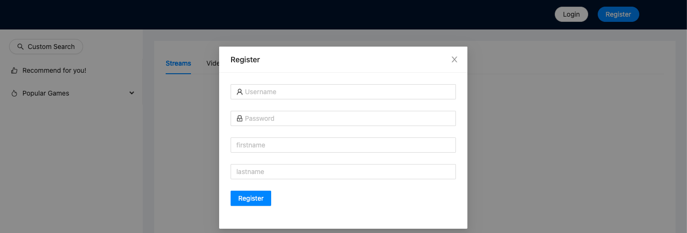
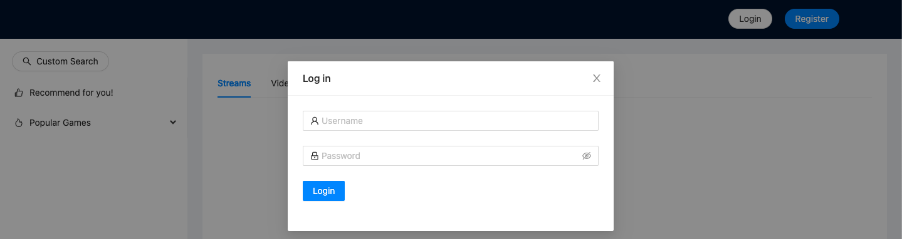
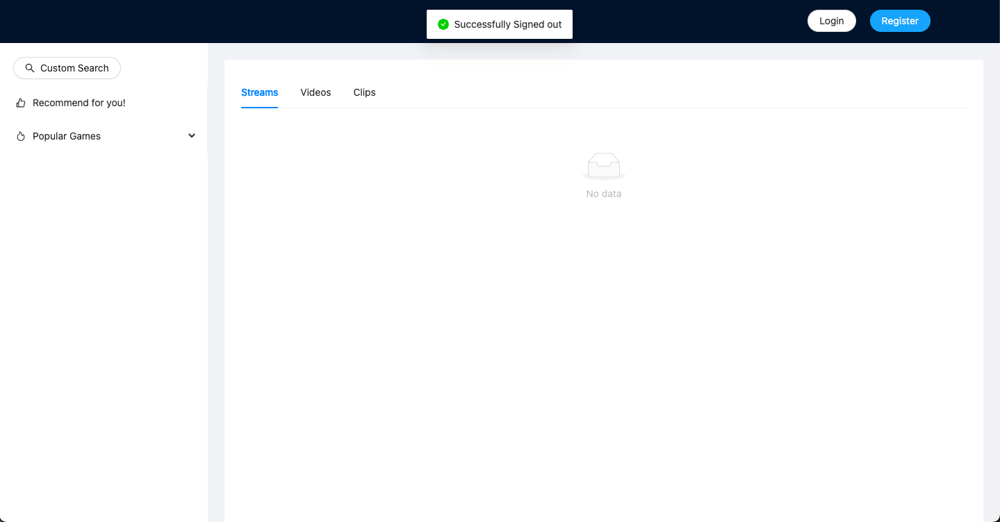
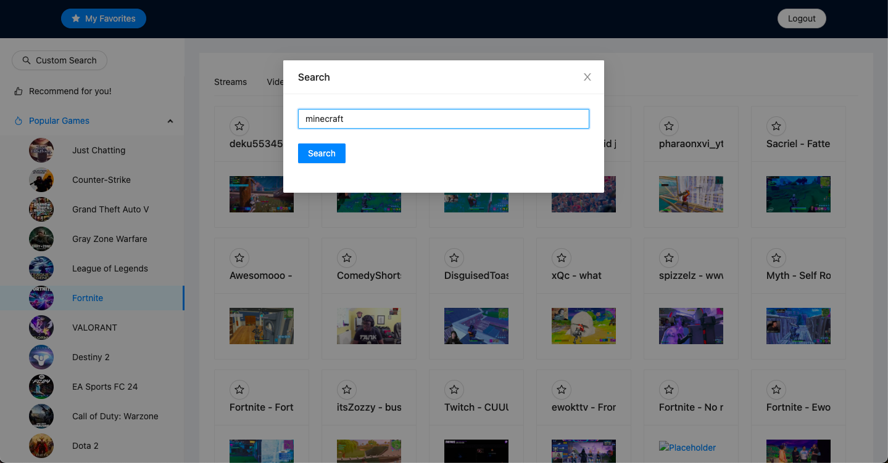
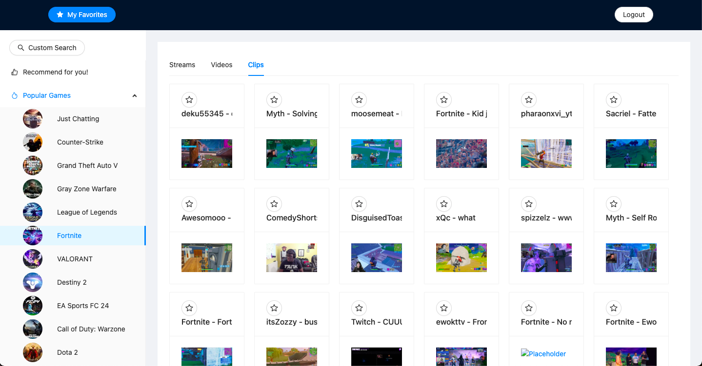
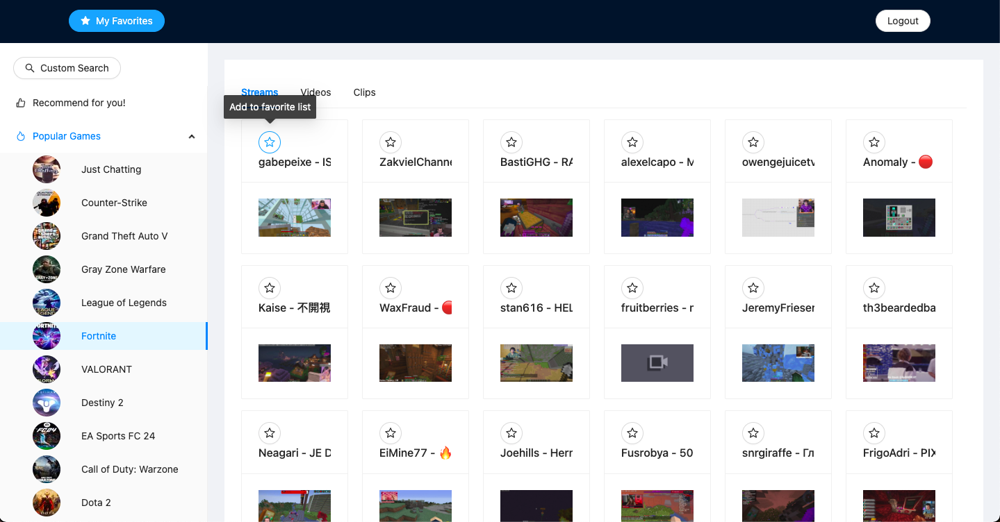
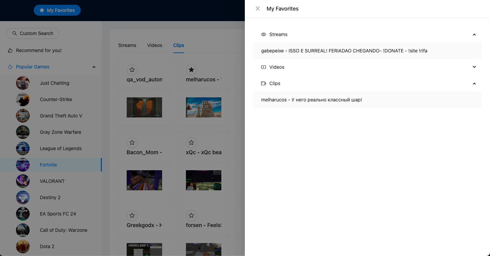
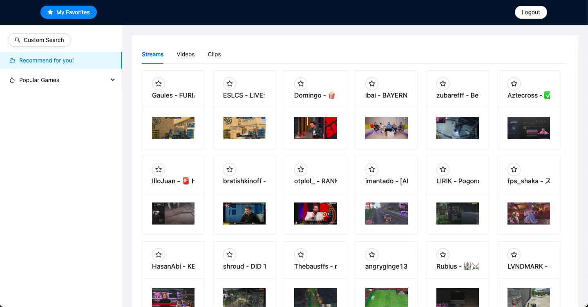

# StreamSense: Personalized Live Stream Search and Recommendations

**StreamSense** helps you discover and enjoy live game streams by providing personalized recommendations and an intuitive search experience.

Visit StreamSense: [StreamSense](https://edq8x8cbc2.us-east-2.awsapprunner.com/)

## Features
- **Authentication:** Register, login, and logout capabilities to secure user profiles.
- **Content Discovery:** Search for games to view corresponding live streams, videos, and clips.
- **Top Games:** Access a list of top games currently trending on Twitch.
- **Favorite Game Resources:** Mark streams, videos, or clips as favorites and review your favorites history.
- **Recommendations:** Receive stream and content recommendations based on your preferences.

## Demo
Explore screenshots from StreamSense showcasing each of our core features:

### Authentication
#### Register

#### Login

#### Logout

### Content Discovery

*Search interface for finding live streams, videos, and clips of games.*

### Top Games

*View the list of top trending games sourced from Twitch.*

### Favorite Game Resources

*Interface for users to mark and delete their favorite streams, videos, and clips.*

*Interface for users to review their favorite streams, videos, and clips.*

### Recommendations

*Personalized game and stream recommendations based on user preferences.*

## Technologies Used
- **Spring Boot (Java):** Backend development framework and primary programming language.
- **MySQL with AWS RDS:** Database for user and application data hosted on AWS.
- **Docker:** Simplifies deployment for efficient containerization.
- **React (HTML, CSS, JavaScript):** JavaScript library and core technologies for building the frontend.
- **Node.js:** JavaScript runtime environment for network applications.
- **Ant Design:** UI framework for designing responsive user interfaces.
- **AWS Service:** 
    - **ECR:** Container registry for storing Docker images.
    - **App Runner:** Manages deployment of containerized applications.
- **Caffeine:** Caching library for performance optimization.
- **Session-based Authentication:** Secures user sessions and data.

## License
MIT License

